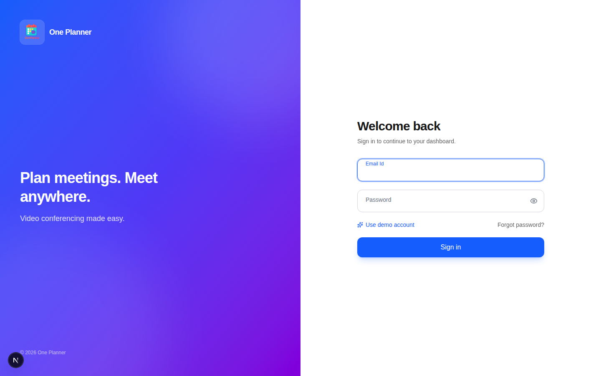
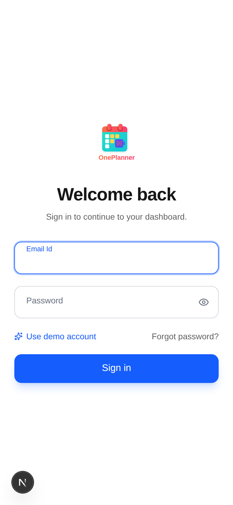
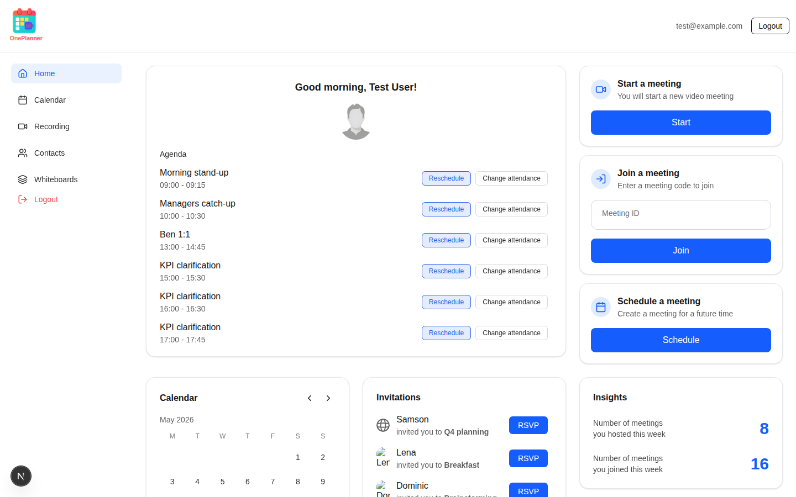
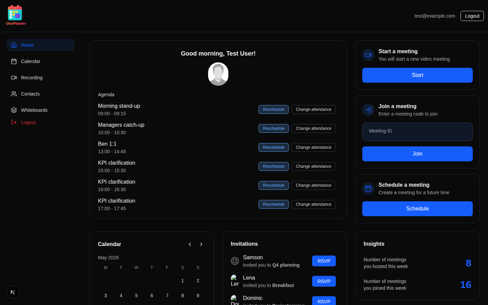
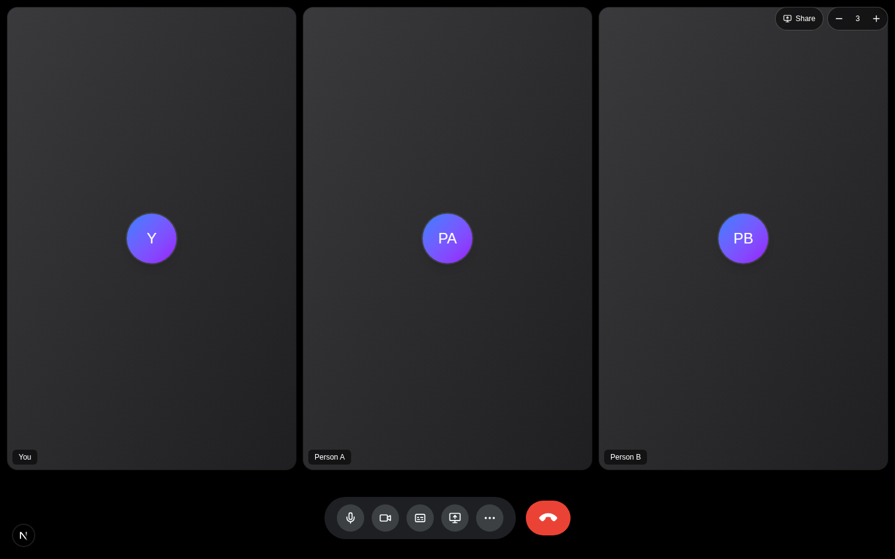
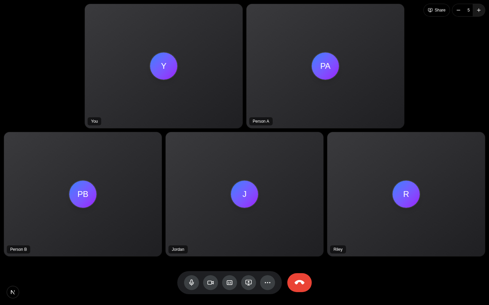
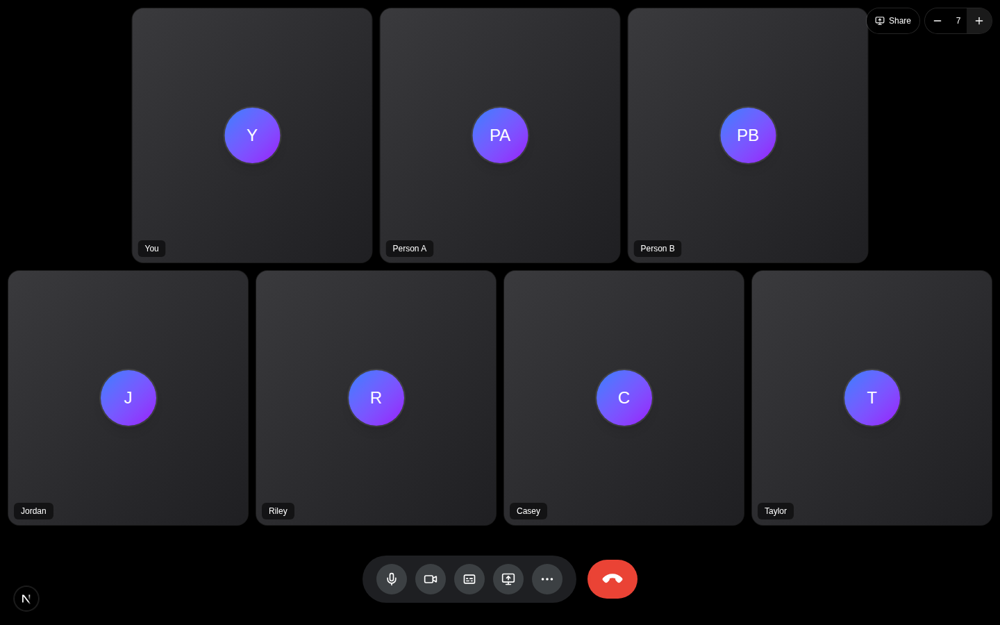
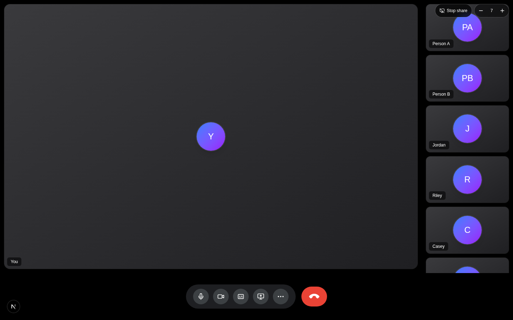

# OnePlanner — Design Brief

**Use this as a single hand-off to a design tool.** Copy from the next line to the end.

---

# OnePlanner — UI/UX design brief

## Project context

OnePlanner is a **practice OS for independent experts** — consultants, trainers, tutors, and coaches who run 1:1 sessions. One branded URL hosts **booking + video session + collaborative whiteboard + per-client timeline + a business dashboard**. The expert's clients never feel handed off to a third-party tool; everything happens at `<expert-handle>.oneplanner.app`.

This is the v1 / POC scope. Healthcare, group calls, and payments are deliberately out.

## What I want from you

1. **A user-journey flowchart** with four swim-lanes: *Expert onboarding*, *Expert daily*, *Client booking*, *Client joining a session*. Show every screen each persona touches, the decision points, and the email/notification triggers.
2. **High-fidelity screen mockups** for the 15 screens in §6 — light + dark, desktop + mobile where called out.
3. **A short style sheet** (~1 page) capturing tokens you settle on (color, type, spacing, radii, elevation) so engineering can wire them up.

Deliverable format: Figma file (preferred) or a folder of PNGs named like `02_dashboard_desktop_light.png`.

## Personas

| Persona | Description |
| --- | --- |
| **The Expert** (primary) | A solo consultant / trainer / tutor / coach. Books their own calendar. Runs 6–20 sessions a week. Cares about: client retention, looking professional, not bouncing between apps. |
| **The Client** | Someone who books a session with the expert. Often a parent (for tutors) or a manager (for trainers). Cares about: a frictionless join, knowing what they paid for. Doesn't have an OnePlanner account. |

## Tone & visual direction

- **Modern, warm, professional.** Not enterprise-cold, not playful-cute.
- The product is the substrate; **the expert's brand is what the client sees**. Default theme should be tasteful and let the expert's accent color carry their identity.
- The current login uses a **blue → indigo → purple gradient** on a dark hero panel beside a clean form. Carry that energy. The video room uses a near-black surface (`#202124`) for the tile chrome — keep that.
- Avoid Zoom / Meet visual clichés (gray gradients, hard rectangles). Lean softer: 16–24 px corner radii, generous whitespace, motion that fades + slides rather than wipes.
- Microinteractions matter: tile reflow when a participant joins, whiteboard pen smoothing, the "saved" pulse on the notes panel.

## Brand tokens (use as starting point, refine in your style sheet)

| Token | Light | Dark |
| --- | --- | --- |
| `bg` | `#ffffff` | `#0a0a0a` |
| `fg` | `#171717` | `#ededed` |
| `surface` (cards, video chrome) | `#ffffff` | `#202124` |
| `border` | `#e5e7eb` | `#1f2937` |
| `primary` | `#2563eb` (blue-600) | `#60a5fa` (blue-400) |
| `primary-soft` | `rgba(37,99,235,0.12)` | `rgba(96,165,250,0.22)` |
| `brand gradient` | `from-blue-600 via-indigo-600 to-purple-700` | same |
| `danger` (hang-up, errors) | `#EA4335` | `#EA4335` |
| `muted` | `#6b7280` | `#94a3b8` |

Type: system stack (Inter / SF Pro fallback). Numerals tabular for dashboard tiles.

Iconography: **lucide-react** (already in the stack). Match its 1.5 px stroke weight.

## Screens to design (15 total)

Each row below is a one-line spec. Per-screen detail follows in §7.

| # | Screen | URL | Variants |
| --- | --- | --- | --- |
| 01 | Login | `/login` | Desktop + Mobile, Light + Dark |
| 02 | Expert dashboard | `/dashboard` | Desktop + Mobile |
| 03 | Client list | `/clients` | Desktop + Mobile |
| 04 | Client profile | `/clients/[id]` | Desktop + Mobile |
| 05 | Past-session detail | `/clients/[id]/sessions/[booking]` | Desktop |
| 06 | Settings — profile | `/settings/profile` | Desktop |
| 07 | Settings — availability | `/settings/availability` | Desktop + Mobile |
| 08 | Settings — session types | `/settings/session-types` | Desktop |
| 09 | Public booking page | `/[handle]` | Desktop + Mobile |
| 10 | Booking — slot + form | `/[handle]` (state) | Mobile most important |
| 11 | Booking confirmation | `/booked/[token]` | Desktop + Mobile |
| 12 | Pre-call lobby | `/[handle]/room/[token]?lobby=1` | Desktop + Mobile |
| 13 | Active video call | `/[handle]/room/[token]` | Desktop + Mobile (1:1 only) |
| 14 | Active call + whiteboard | (toggle) | Desktop primarily |
| 15 | End-of-call screen | `/[handle]/room/[token]/done` | Desktop + Mobile |

## Per-screen briefs

### 01 — Login (reference; already built)

- Split panel desktop: branded gradient hero left (logo + tagline), form right.
- Form: email, password (with show/hide toggle), "Use demo account" pill, "Forgot password?" link, "Sign in" button with spinner state.
- Mobile: collapses to single column with logo on top.
- Already implemented — see `src/app/login/page.tsx` and `src/components/auth/LoginForm.tsx`. Treat as the visual reference for everything else.

### 02 — Expert dashboard `/dashboard`

The expert's home. Should answer "what's happening today" and "how is my practice doing."

**Layout:** sidebar nav (Home, Clients, Settings, Logout) + main content.

**Hero strip (4 tiles):**
- Sessions this week (count, delta vs last week)
- Hours this week (decimal, e.g. "5.5 h")
- Est. revenue this month (sessions × rate; show in expert's currency)
- No-show rate last 30 days (%)

**Upcoming session card (large, single):**
- Client name + photo
- Session type + duration
- Start time (with "in 12 min" countdown when within an hour)
- "Start now" primary CTA (turns green when within 5 min of start)
- Secondary: "Reschedule", "Cancel"

**Today's agenda (list):** remaining sessions today, compact cards.

**This-week rolling agenda (collapsible):** next 7 days, grouped by day.

**Right rail:**
- **"Clients lapsing"** — up to 5 clients with no upcoming booking and no session in 30 days. Each row: avatar, name, "Send rebook link" inline action.
- **"Share your booking page"** — the expert's public link with copy button.

**Empty states:**
- No clients yet → big card: "Share your booking link to get your first client" with the link prominent.
- No sessions today → "Nothing on the calendar today. Want to message a lapsing client?"

### 03 — Client list `/clients`

- Search bar (debounced).
- Filters: tag, has-upcoming, lapsing, sort.
- Table: avatar, name, email (muted), last session, next session, tags, "Book" + "Open" actions.
- Empty: same as dashboard empty.

### 04 — Client profile `/clients/[id]`

The relationship view. This is where progress tracking lives.

**Header:**
- Avatar (large), name, email, tags (editable chips), timezone, since-date.
- Primary CTA: **"Book next session"**.
- Secondary: "Send rebook link", more menu.

**Tabs:**
- **Sessions** (default) — reverse-chronological cards:
  - Date, duration, session type
  - Note preview (3 lines)
  - Whiteboard thumbnail if present
  - "Open" link → past-session detail
- **Notes** — flat list of every note across sessions, dated.
- **Whiteboards** — gallery of saved whiteboards, click to open.
- **Files** — not in POC; show a placeholder ("Coming soon").

### 05 — Past-session detail `/clients/[id]/sessions/[booking]`

- Header: client name (link), date, duration, session type.
- Note (full text, edit-in-place for the expert).
- Whiteboard (read-only Excalidraw rendering the saved snapshot; "Edit" toggle later).

### 06–08 — Settings

Three tabs in `/settings`:

**Profile** — name, handle (read-only after first set, with availability check on first), photo upload, short bio, specialties (chips), languages, timezone (autocomplete), hourly rate + currency.

**Availability** — weekly grid (Sun–Sat × hours). Click-drag to add/remove available blocks per day. Live "preview your booking page" link.

**Session types** — up to 3 cards in v1. Per card: name, duration, color accent, description. "Add session type" CTA (disabled at 3 with explainer).

### 09 — Public booking page `/[handle]`

What the client sees. Should feel like the **expert's** site, not OnePlanner's.

**Top:** expert photo, name, specialties, language flags, hourly rate, short bio (3–4 lines). Subtle "Powered by OnePlanner" footer (paid plan hides this).

**Session type selector:** if multiple, a pill row. If single, just labels.

**Calendar (desktop):** month view with available days dotted. Pick a day → reveals time slots column on the right.

**Calendar (mobile):** horizontal scroller of next 14 days; tap → slots stack below.

**No-availability state:** "No slots in the next 14 days. Want to be notified when a slot opens?" with an email field.

### 10 — Booking — slot + form (modal/step inside `/[handle]`)

Once a slot is chosen:
- Selected slot summary at top (date, time in *client's* TZ, expert TZ shown beneath as muted line).
- Name field.
- Email field.
- Optional "What would you like to focus on?" textarea.
- Primary: "Confirm booking".
- Cancel returns to the slot picker.

### 11 — Booking confirmation `/booked/[token]`

- Big check icon, "You're booked with [Expert]".
- Date + time in client TZ + expert TZ.
- "Add to calendar" — Google, Outlook, Apple, .ics download.
- "Join link will be in the reminder email 10 min before the session."
- "What to expect" tips (3 short bullets, expert-customizable later).
- Secondary: "Need to reschedule?" link.

### 12 — Pre-call lobby `/[handle]/room/[token]?lobby=1`

Both expert and client land here before the call.

- Big self-camera preview (rounded).
- Below: mic toggle, cam toggle, device picker (mic / camera / speaker dropdowns).
- Name input (clients only, prefilled from booking).
- "[Expert is not here yet]" / "[Client is not here yet]" status row.
- Primary: "Join now" — disabled until camera permission granted.

### 13 — Active video call `/[handle]/room/[token]` (1:1)

- Full-bleed dark surface. Tile grid using the Google-Meet dynamic layout (tall portrait tiles for 1:1; **already implemented** — see `src/components/meeting/VideoGrid.tsx`).
- Top-right: connection-strength pill, elapsed-time chip, "minimize" arrow.
- Bottom: floating pill of controls — mic, cam, screen-share, **whiteboard toggle**, **notes toggle**, "more" — and a separate **red pill hang-up** to the right (already implemented in `src/components/meeting/Controls.tsx`; replicate that pattern).
- Right rail (collapsible, ~320 px) — **notes panel**: textarea, "Notes for this session", autosave timestamp, "Only visible to you" hint.

States to design:
- Connecting (skeleton over self-tile).
- Reconnecting (small toast bottom-left).
- Network unstable (toast).
- Peer left (ghost tile with "Sam left the call · 32s ago" + "Wait" / "End" CTAs).

### 14 — Active call + whiteboard mode

Toggling the whiteboard:
- Whiteboard expands to full canvas; video tiles shrink to a 2-tile filmstrip in the top-right.
- Excalidraw-style toolbar top-center (pen, shapes, text, sticky, eraser, color, undo, redo).
- "Saving…" indicator on top-right when state changes.
- The notes panel can be open simultaneously (right rail).

### 15 — End-of-call screen `/[handle]/room/[token]/done`

Two variants:

**Expert variant:**
- "Session complete." Duration shown.
- "Your note was saved." (snippet preview).
- CTAs: "Open [Client]'s profile", "Book next session", "Back to dashboard".

**Client variant:**
- "Thanks for joining."
- "[Expert] will be in touch."
- Optional: 5-star rating (POC: skip).

## Components to design once, used everywhere

- **Tile grid (video)** — already coded; design language for it should match the rest of the system. Tall portrait tiles, 12 px gap, 16 px radius, 1 px white-10% inner ring. Match the existing `VideoGrid` behavior.
- **Floating-label input** — already coded in `src/components/ui/Input.tsx` (with optional trailing icon slot for show/hide password etc.). Re-use everywhere.
- **Button** — primary (blue), secondary (outline), danger (red, for hang-up / destructive), ghost. Add a loading state (spinner inline).
- **Card** — elevated white/dark surface, 16 px radius, 1 px border.
- **Pill control bar** — for the in-call controls. Match `Controls.tsx`.
- **Calendar / slot picker** — month/week view + time-slot column.
- **Avatar with initials fallback** — already designed in the video tile; reuse the gradient `from-blue-500 to-purple-600` for initials.
- **Empty state pattern** — illustration + headline + body + primary CTA.
- **Skeleton loaders** — not spinners.

## User flowchart (the 4 lanes)

### A. Expert onboarding
`Sign up` → `Verify email (skip in POC)` → `Choose handle` → `Set timezone + availability` → `Add a session type` → `Set hourly rate` → `Copy booking link` → `Test booking in another tab` → `Done (lands on Dashboard with seeded sample state)`

### B. Expert daily
`Login` → `Dashboard` → see *Upcoming Session* card → `Start session` → `Lobby` → `Active call` → optionally toggle `Whiteboard` and `Notes` → `Hang up` → `End-of-call screen` → `Open Client profile` → `Book next session` → `Done`

### C. Client booking
Land on `/[handle]` → select `Session type` → pick `Day` on the calendar → pick `Slot` → enter `Name + Email` → `Confirm` → `Booking confirmation` → `.ics added to client's calendar` → console-logged "email" (POC) / real email (v1) → `Done`

### D. Client joining
Reminder "email" 10 min before → click `Join` → land on `Lobby` → camera/mic permission → see `Waiting for [Expert]` → expert joins → `Active call` → `Hang up` → `End-of-call (client variant)` → `Done`

Also document the **edge branches**:
- Booking conflict (slot taken between choosing and confirming) → toast + back to slot picker.
- Cam/mic denied → "We need camera access" screen with browser-specific instructions.
- Peer never joins → after 10 min, expert sees "Sam hasn't joined. Mark as no-show?" prompt.

## Accessibility & state coverage (don't skip)

Every screen must show:
- **Empty** state with a copy + CTA.
- **Loading** state — skeletons, not spinners (except for in-button submission).
- **Error** state with retry.
- **Focus rings** on every interactive element.
- **Dark-mode parity**.
- **Reduced-motion** alternative for the tile-reflow + whiteboard animations.

## Reference screenshots

These are captured from a running build of the repo (`npm run dev`). They are the **visual ground truth** for the existing pieces — match the brand energy and component patterns shown here.

### Login — desktop (the brand direction)

Split panel: gradient hero left (blue → indigo → purple, soft blur blobs, logo card top-left, tagline mid-page, year/footer bottom-left), clean white form right (welcome heading + subtitle, floating-label inputs, eye-toggle on password, "Use demo account" pill + "Forgot password?" link, full-width Sign-in CTA). **All future flows should feel like this lives next to them.**

### Login — mobile

Single column. Logo on top, form below. Hero disappears on `lg:` breakpoint.

### Dashboard — current state (needs redesign)

The **sidebar pattern** (Home / Calendar / Recording / Contacts / Whiteboards + Logout) and the **layout grid** are fine to keep — both themes use the same structure with token-driven surfaces. The right-column content is legacy mock data ("Agenda", "Invitations") and should be **redesigned per §7 Screen 02** — sessions/hours/revenue/no-show tiles, the next-session card, today's agenda list, the lapsing-clients rail.

**Theme reference:** Dark mode pulls colors from `--color-background: #0a0a0a` / `--color-foreground: #ededed` (see `src/app/globals.css`). Cards and inputs use the same hierarchy; only the surface, border, and muted-text tokens flip. Match this when designing — don't introduce new dark-mode color rules.

### Video room — 3 participants (1:1 default for the POC)

3-person honeycomb layout: 3 tiles in one row, tall portrait shape, 16 px gap, white-10% inner ring. Avatar fallback uses the **blue-500 → purple-600** gradient with initials.

### Video room — 5 participants

Google Meet's "Dynamic" rule: 5 = `[2, 3]` with the **smaller row centered on top**. All tiles same size; the top row simply doesn't fill the row width. Reflows with a spring animation when N changes.

### Video room — 7 participants

7 = `[3, 4]` (smaller row on top). The dynamic layout function lives in `src/components/meeting/VideoGrid.tsx::getRowsLandscape`.

### Video room — screen-share mode

Presenter occupies the left ~80%; remaining participants stack as a right rail filmstrip. Sidebar slides in from the right when share starts (spring), slides out on stop.

**Common in-call elements visible in all four meeting shots:**
- The bottom-center **floating pill** with mic / cam / captions / share / more icons — keep this pattern.
- The **red hangup pill** to the right with the rotated-135° filled phone icon (Meet/Zoom convention; replaces a struck-through phone).
- Top-right **demo controls** (Share toggle + participant count + / −) — these are dev-only and should NOT appear in the final design; they exist in the build only to let the layout be exercised.
- Initials avatars are placeholders for the actual webcam feed — design tiles for the *with-video* state primarily; the avatar fallback shown here is acceptable as-is.

## Reference: existing code & components

The repo at `/home/arnab-kar/Desktop/Work/OnePlanner` has these working components — use them as visual + behavioral references:

| Component / page | Path | Notes |
| --- | --- | --- |
| Login | [`src/app/login/page.tsx`](src/app/login/page.tsx), [`src/components/auth/LoginForm.tsx`](src/components/auth/LoginForm.tsx) | Brand direction reference — gradient hero, floating-label inputs, eye-toggle password, demo-fill pill, spring entry animation. |
| Floating-label input | [`src/components/ui/Input.tsx`](src/components/ui/Input.tsx) | Has `trailing` slot for icon buttons. |
| Video tile grid (1:1, 2-person, N-person) | [`src/components/meeting/VideoGrid.tsx`](src/components/meeting/VideoGrid.tsx) | Implements Meet's "Dynamic" tile layout: portrait tiles, full-height, smooth FLIP reflow on add/remove. Keep visually. |
| In-call control bar + hang-up | [`src/components/meeting/Controls.tsx`](src/components/meeting/Controls.tsx) | Floating dark-pill with circular buttons + red phone-pill hang-up. Reuse style. |
| Dashboard (legacy) | [`src/app/dashboard/page.tsx`](src/app/dashboard/page.tsx), [`src/app/dashboard/DashboardClient.tsx`](src/app/dashboard/DashboardClient.tsx) | The sidebar pattern works; the right-column content is mock data and should be redesigned around the new dashboard brief. |
| Global tokens | [`src/app/globals.css`](src/app/globals.css) | CSS variables for colors. |
| Tailwind config | implicit via Tailwind v4 directives in `globals.css` | |
| Brand assets | [`public/brand_logo.svg`](public/brand_logo.svg), [`public/1loom.svg`](public/1loom.svg) | |

## Constraints & non-goals

- **No screen recording UI** in v1.
- **No payments UI** — invoicing happens off-platform.
- **No group-call UI** — 1:1 only.
- **No marketplace** — every page is single-expert.
- **No "Powered by OnePlanner" badge on paid-tier client-facing pages**, only on free.

## Open design questions (decide and document in the style sheet)

1. **Booking page brand vs. OnePlanner brand:** how much expert-customization (accent color, photo background) is allowed in v1? My preference: a single accent color picker + tasteful defaults; no logo upload yet.
2. **Mobile in-call controls placement:** Meet's bottom row vs. floating side dial — recommend bottom row for thumb reach.
3. **Whiteboard tool-set scope:** match Excalidraw's defaults? Reduce to 5–6 essentials for the POC?
4. **Empty state illustrations:** custom illustrations vs. iconography only? Recommend iconography for v1 to ship faster.

---

# End of brief

Hand this whole document over. Reference images from a running `npm run dev` of the repo are optional; the code paths above are the canonical visual source.
